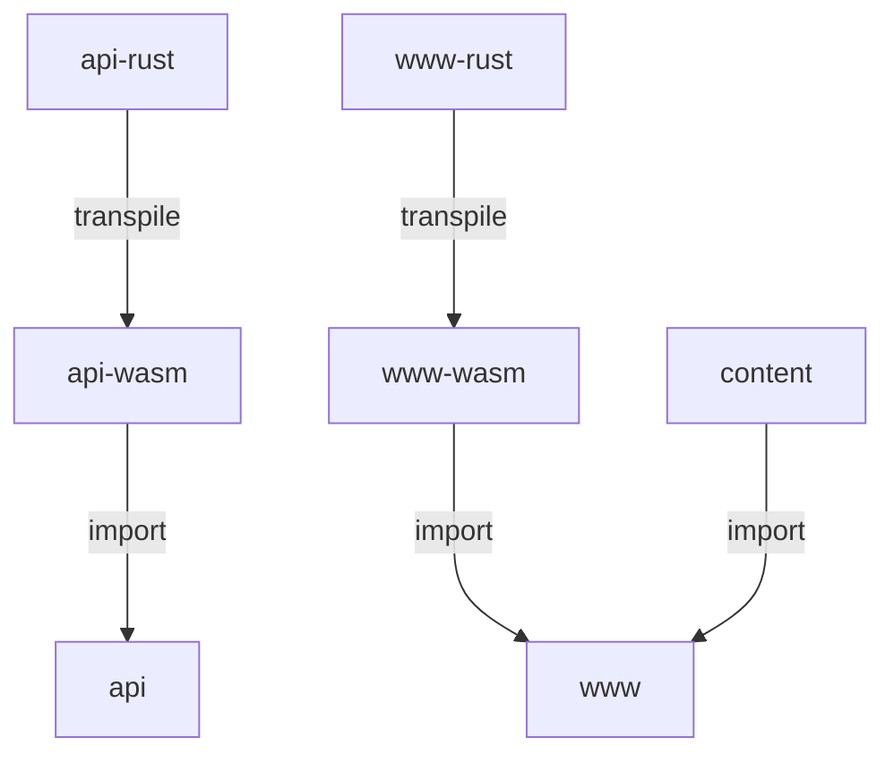

# Oceanics.io

## Contents

- [Oceanics.io](#oceanicsio)
  - [Contents](#contents)
  - [About](#about)
  - [Getting started](#getting-started)
  - [Workspaces](#workspaces)
    - [Website](#website)
    - [API](#api)
  - [Logging](#logging)
  - [Environment](#environment)
  - [Database initialization](#database-initialization)

## About

This document is for developers of `oceanics.io`, a web application for high-performance ocean computing and visualization. 

Software is provided by Oceanicsdotio LLC under the [MIT license](https://github.com/oceanics-io/oceanics.io/blob/main/LICENSE) as is, with no warranty or guarantee. 

## Getting started

The top-level directory also contains this `README.md` along with configuration files and scripts for linting, compiling, bundling, and deploying. The complete build and test processes are defined in `makefile`. 

The site is hosted on Netlify at [https://www.oceanics.io](https://www.oceanics.io). The deploy is setup in `netlify.toml`. When updates are pushed to Github, the site is rebuilt and deployed automatically.

## Workspaces

We use a `yarn` monorepo and workspaces to manage code. The environment configuration lives in `.yarnrc.yml`, and version controlled plugins in `.yarn`. 

Workspaces and shared dependencies are defined in `package.json`.

Rust-to-Web-Assembly libraries used by these workspaces are in `oceanics-io-*-rust`.

Dependencies of the main components are:



### Website

The `oceanics-io-www` workspace contains the TypeScript web application. 

This is our main web page, powered by NextJS. Component-level development is supported by StorybookJS. Client side interaction is accomplished with React Hooks and browser APIs.

You should not need to manually build this workspace; everything is handled from the top-level directory.

### API

Netlify serverless functions that make up our API are `oceanics-io-api`. These are single purpose endpoints that support secure data access, pre-processing, and sub-setting.

This module is a build environment, so you won't run any commands directly. Local testing requires the Netlify CLI, which is installed from the parent module.

You'll first have to create the root provider by executing a query like:
```cypher
MERGE (n:Provider { apiKey: replace(apoc.create.uuid(), '-', ''), domain: 'oceanics.io' }) return n
```

You can run the Neo4j database manager in a [Neo4j container image](https://hub.docker.com/_/neo4j/), or use a managed service that supports [cypher](https://neo4j.com/docs/cypher-refcard/current/). 

Running automated tests populates the connected database with the examples described in `oceanics-io-www/public/bathysphere.yaml`. The [browser interface](https://neo4j.com/developer/neo4j-browser/) can be used to explore the example database.

The minimal example to get up and running is:

```bash
make oceanics-io-api/build
make dev & # run Netlify dev stack, use another terminal
make test
```

## Logging

Logging is setup [through Logtail for JavaScript](https://docs.logtail.com/integrations/javascript).

If you want to get performance metrics from the log database, you can use a query like:
```sql
SELECT
  substring(context.runtime.file, 35) as file,
  httpmethod AS method,
  avg(cast(elapsedtime AS INT)) AS time,
  avg(cast(arraybuffers AS INT))/1000 AS arraybuffers_kb,
  avg(cast(heaptotal AS INT))/1000 AS heaptotal_kb,
  avg(cast(heapused AS INT))/1000 AS heapused_kb,
  avg(cast(external AS INT))/1000 AS external_kb,
  count(*) as requests
FROM $table
WHERE
  elapsedtime IS NOT NULL AND
  heaptotal IS NOT NULL AND
  heapused IS NOT NULL AND
  external IS NOT NULL AND
  arraybuffers IS NOT NULL
GROUP BY 
  file,
  method
```

## Environment

These environment variables must be present for things to work:

- `NEO4J_HOSTNAME`: the hostname for Neo4j instance
- `NEO4J_ACCESS_KEY`: the password for Neo4j instance
- `SPACES_ACCESS_KEY`: for accessing storage
- `SPACES_SECRET_KEY`: for accessing storage
- `STORAGE_ENDPOINT`: the region and host for cloud storage
- `BUCKET_NAME`: the prefix to the storage endpoint
- `SERVICE_PROVIDER_API_KEY`: Provider API key for registering accounts
- `SIGNING_KEY`: A signing ket for producing JWT in-application
- `SERVICE_ACCOUNT_USERNAME`: email for service account
- `SERVICE_ACCOUNT_PASSWORD`: password for service account
- `SERVICE_ACCOUNT_SECRET`: string for salting service key password
- `NEXT_PUBLIC_MAPBOX_ACCESS_TOKEN`: mapbox access token for map interface

## Database initialization

You can run the database manager in an [official Neo4j container image](https://hub.docker.com/_/neo4j/), or use a managed service that supports the [cypher query language](https://neo4j.com/docs/cypher-refcard/current/).

The [browser interface](https://neo4j.com/developer/neo4j-browser/) is useful for debugging data access layer errors.

You'll have to create the root provider by executing a query like:
```cypher
MERGE (n:Provider { apiKey: replace(apoc.create.uuid(), '-', ''), domain: 'oceanics.io' }) return n
```
