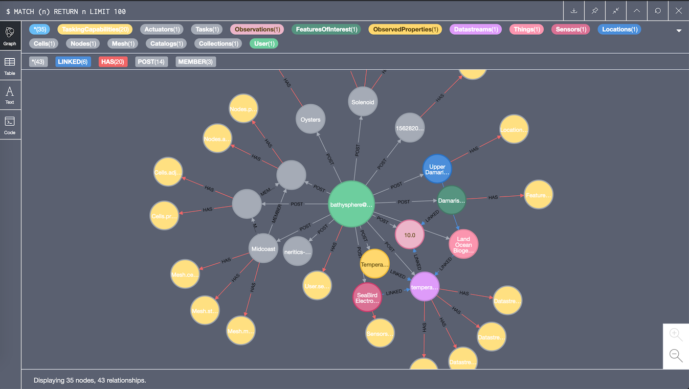
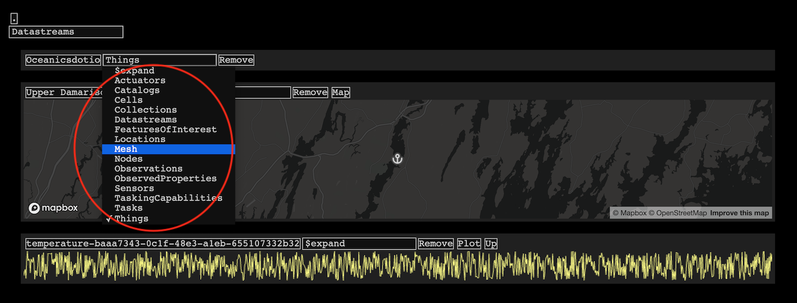
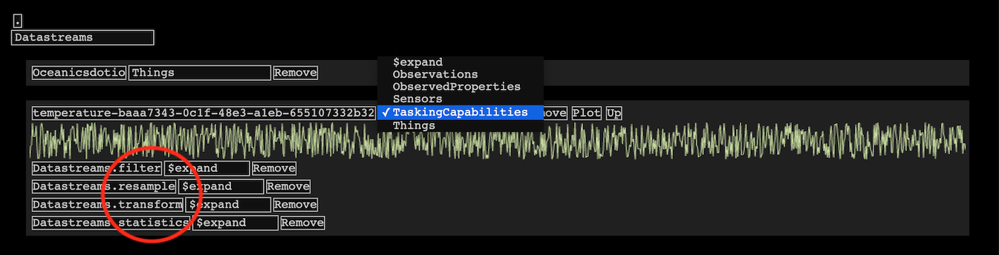

Excited to announce that we've been accepted into the Neo4j start-up program. 

This means we'll be able to continue develop graph-based algorithms and data systems with awesome enterprise features 
like high-availability distributed databases with causal clustering.

The geospatial graph extension of Bathysphere is our core system for analyzing highly-connected heterogeneous data. 

Open Geospatial Consortium SensorThings API compliant data are stored in a graph database. This shows the Neo4j browser. 

You can check out the OpenAPI specification for the Graph API here. 

The default data models and relationships allow rich context-based displays and analyses, with support for 
multidimensional array data (such as 3D simulation meshes or satellite data) as well as time series. 
This UI is our free-form entity browser, which uses Mapbox and WebGL. 

The service combines SpatioTemporal Assets Catalog (STAC) and Open Geospatial Consortium (OGC) SensorThings API 
specifications to provide domain-specific topologies for sensor networks, scientific meshes, control systems, 
and user authentication/permissioning. 

The graph metadata also registers analytical services that process data assets. For example, converting raw satellite 
brightness temperatures to sea-surface temperature, or using fast Fourier transforms to filter signals.

Data transformations are represented as Tasking Capabilities, per SensorThings API part 2. We depart from official 
OGC web standards a bit here. All database models have capabilities, steps of which may require services spread across 
different compute locations.

Signal processing capabilities for a temperature stream include conversion to frequency domain, frequency filtering, 
smoothing, resampling, et cetera. The time series is stored in the graph as a reference to a Postgres table-column 
combination, CSV text file, or JSON-like serialized binary. 

Functions-as-a-service and connected microservices are mapped to capabilities, 
which are linked to instances of the data models.
