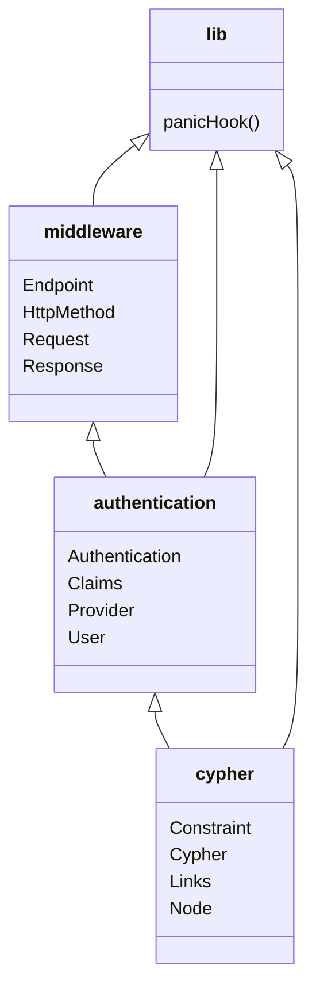

# Quick start

This module is a build environment, so you won't run any commands directly. 

Local testing requires Netlify, which is installed from the parent module.

You'll need to have created a Provider node in the Neo4j database, and added the API key to your local environment. 

The minimal example to get up and running is:

```bash
make api
make api-dev & # run Netlify dev stack, use another terminal
make test
```


## Logging

Logging is setup [through Logtail for JavaScript](https://docs.logtail.com/integrations/javascript).

If you want to get performance metrics from the log database, you can use a query like:
```sql
SELECT
  substring(context.runtime.file, 35) as file,
  httpmethod AS method,
  avg(cast(elapsedtime AS INT)) AS time,
  avg(cast(arraybuffers AS INT))/1000 AS arraybuffers_kb,
  avg(cast(heaptotal AS INT))/1000 AS heaptotal_kb,
  avg(cast(heapused AS INT))/1000 AS heapused_kb,
  avg(cast(external AS INT))/1000 AS external_kb,
  count(*) as requests
FROM $table
WHERE
  elapsedtime IS NOT NULL AND
  heaptotal IS NOT NULL AND
  heapused IS NOT NULL AND
  external IS NOT NULL AND
  arraybuffers IS NOT NULL
GROUP BY 
  file,
  method
```

## Rust middleware bindings

The package uses the `oceanics-io-api-rust` crate, transpiled to web assembly (`oceanics-io-api-wasm`). Functionality is divided between modules within the library,


- `authentication`: includes functionality related to API security.
- `cypher`: drivers for creating Neo4j queries in the cypher query language. See the `src/shared/queries.ts` for usage. 
- `middleware`: everything needed to power the cloud function router in `src/shared/middleware.ts`. 
- `lib.rs`: imports and exposes the modules.



