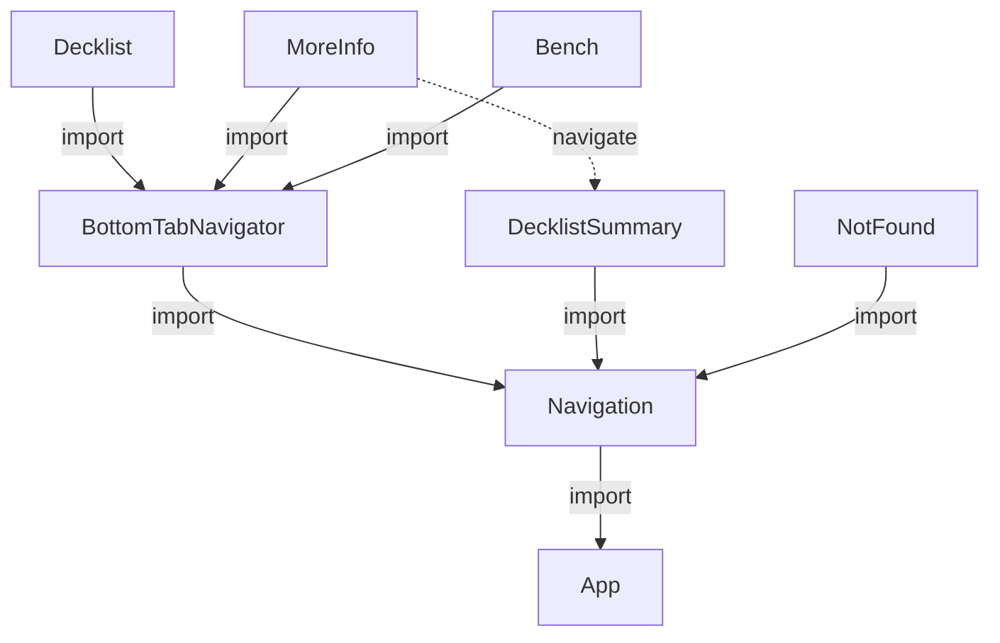

# Gathering

## Purpose

This is a reference implementation for a cross platform application using Expo, React Native, [MMKV](https://github.com/mrousavy/react-native-mmkv), and Storybook. It follows the [component-driven development](https://www.componentdriven.org/) philosophy.

## Quickstart

The Expo project was initialized with `npx expo init .`. Storybook was added with the step [described in the React Native tutorial](https://storybook.js.org/tutorials/intro-to-storybook/react-native/en/get-started/). It was necessary to modify the `addons.js` imports to get things working.

The app can be started on the Expo server with `expo start`, which will publish an iOS and Web version on MacOS.

To run just the mobile version you can `yarn ios`. You can access this from a phone that has Expo Go installed.

## Dependencies 

### Postgres

Uses a cloud Postgres database on DigitalOcean. If developing from Mac, use `psql` to sanity check. You'll have to add Postgres.app [to your path after installing](https://postgresapp.com/documentation/cli-tools.html):
```bash
sudo mkdir -p /etc/paths.d &&
echo /Applications/Postgres.app/Contents/Versions/latest/bin | sudo tee /etc/paths.d/postgresapp
```

### Component topology

The dependency graph of the navigation ans screen components is provided below for reference:



### Further reading

 - [Available Expo icons catalog](https://icons.expo.fyi/)
 - [React Navigation docs](https://reactnavigation.org/)
 - [Apollo Cloud Function](https://www.apollographql.com/docs/apollo-server/v2/deployment/netlify/)
 - [Netlify CLI for local GQL server](https://docs.netlify.com/cli/get-started/)

## Data models

### Entities

- Collection: abstract container for cards. Could be 
- Card: The named entity, which includes its rules. For example "Swamp".
- Version: The unique version of the card including its print set, language, and treatment. For example ("Alpha", "English", "None")
- Condition: The grading criteria which will be used. This can change over time, and will be used to retrieve historical pricing data. It is likely to only worsen over time unless there was a mis-grade.
- Price: The price associated with a unique combination of (Card, Version, Condition)
- Transaction: Describes metadata of moving Card between collections. Includes additions and deletions. 

