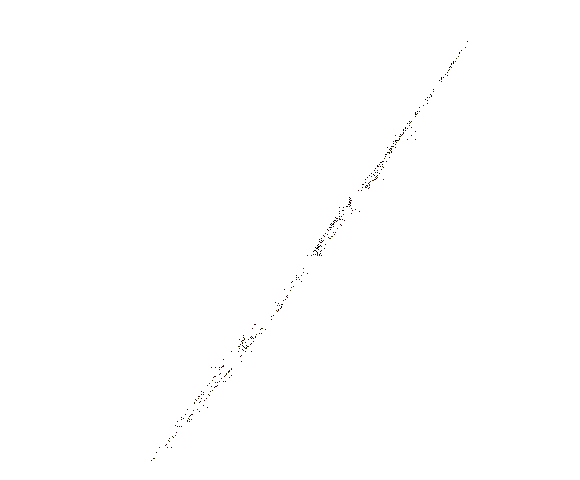

Hi, welcome. 

This is a parking spot for ocean data science products and web services. 
We'll post updates here to share progress, eye candy, and algorithms from ongoing open source projects.

Here's an early GLSL test for the Midcoast Maine hydrodynamic mesh, 
rendered at 600fps. We like Python. 

